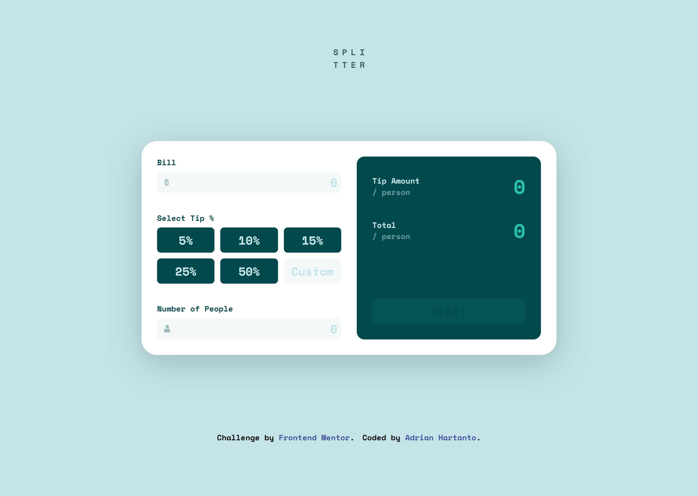
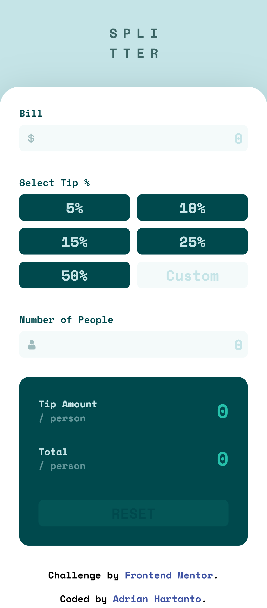
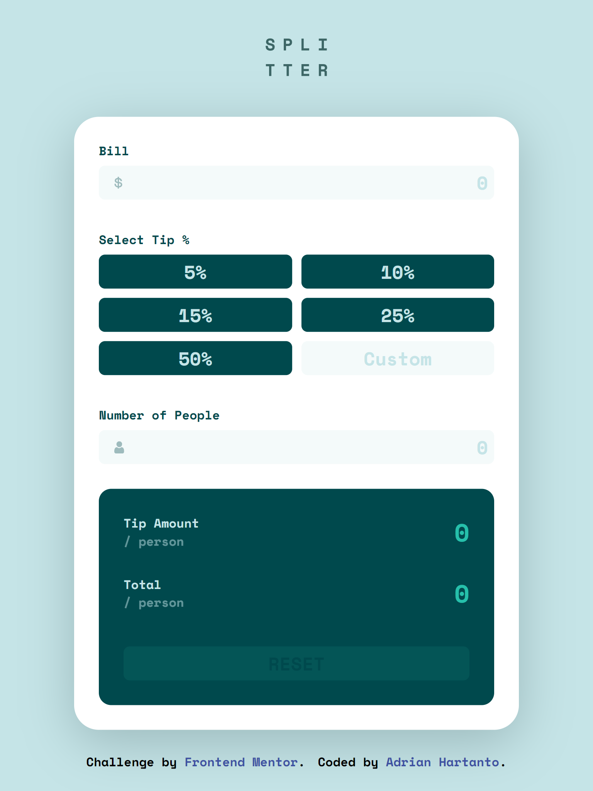

# Frontend Mentor - Tip calculator app solution

This is a solution to the [Tip calculator app challenge on Frontend Mentor](https://www.frontendmentor.io/challenges/tip-calculator-app-ugJNGbJUX). Frontend Mentor challenges help you improve your coding skills by building realistic projects.

## Table of contents

- [Overview](#overview)
  - [The challenge](#the-challenge)
  - [Screenshot](#screenshot)
  - [Links](#links)
- [My process](#my-process)
  - [Built with](#built-with)
  - [What I learned](#what-i-learned)
  - [Continued development](#continued-development)
- [Author](#author)

## Overview

### The challenge

Users should be able to:

- View the optimal layout for the app depending on their device's screen size
- See hover states for all interactive elements on the page
- Calculate the correct tip and total cost of the bill per person

### Screenshot

Desktop Solution

Mobile Solution

Tablet Solution

### Links

- Solution URL: [GitHub](https://github.com/adrianh42/tip-calculator-app-main)
- Live Site URL: [GitHub Pages](https://adrianh42.github.io/tip-calculator-app-main)

## My process

I wrote down the HTML elements first. Styling with SCSS and CSS grid, using vanilla Javascript.

### Built with

- Semantic HTML5 markup
- SCSS
- Flexbox
- CSS Grid
- Javascript

### What I learned

I learned CSS grid to create the button group. 

### Continued development

Perfecting my understanding of CSS Grids, and also sharpening my Javascript skills.

## Author

- Frontend Mentor - [@adrianh42](https://www.frontendmentor.io/profile/adrianh42)